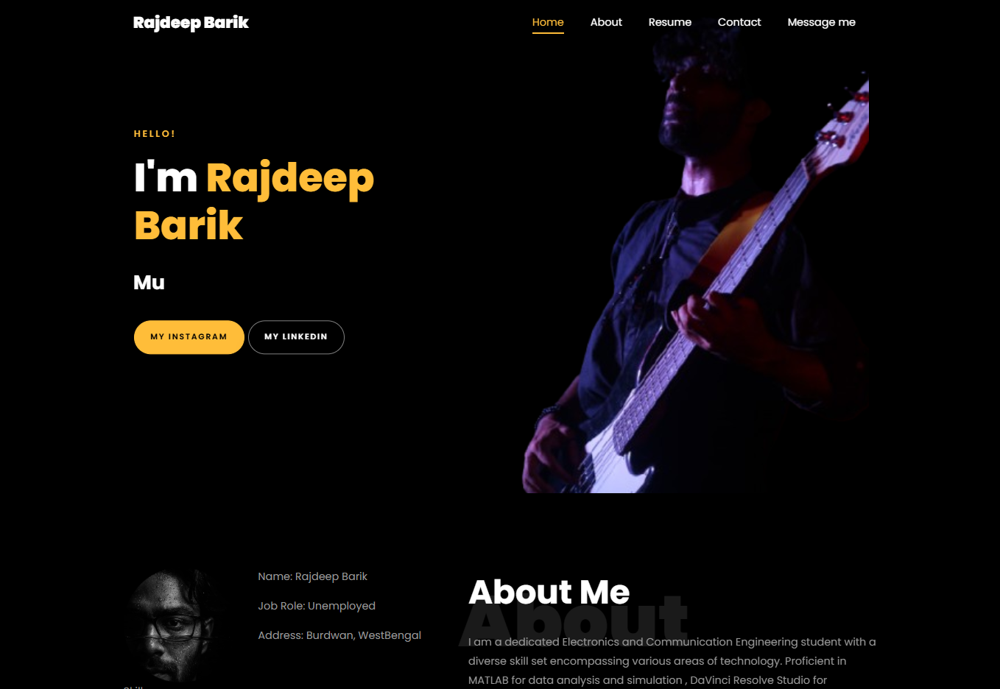

# 🎨 Rajdeep Barik – Personal Portfolio Website

Welcome to the repository for my personal portfolio website, showcasing my journey as an Electronics & Communication Engineering student, full-stack developer, and freelance musician.

Explore the live version of my portfolio: [barik-rajdeep.github.io/Portfolio-main](https://barik-rajdeep.github.io/Portfolio-main/)

 🧾 Table of Contents

* [Features](#features)
* [Tech Stack](#tech-stack)
* [Getting Started](#getting-started)
* [Deployment](#deployment)
* [Contributing](#contributing)
* [License](#license)
* [Contact](#contact)

 ✨ Features

* **Responsive Design**: Seamless experience across devices.
* **About Me**: Insight into my background and interests.
* **Resume**: Detailed overview of my education and professional experience.
* **Skills**: Highlighting my technical proficiencies.
* **Projects**: Showcasing my work and contributions.
* **Contact Form**: Easy way to get in touch with me.

 🛠️ Tech Stack

* **Frontend**: HTML5, CSS3, JavaScript
* **Design Tools**: Canva, DaVinci Resolve Studio
* **Programming Languages**: Python, C++, MATLAB, SQL
* **Other Tools**: Studio One (Music Production)

 📦 Deployment

The website is hosted using GitHub Pages. To deploy:

1. **Push your changes to the `main` branch**.
2. **Navigate to the repository settings**.
3. **Under "Pages", select the source as `main` branch and root directory**.
4. **Save and your site will be live at `https://yourusername.github.io/Portfolio-main/`**.

 📄 License

This project is licensed under the [MIT License](LICENSE).

 📬 Contact

* **Email**: [rajdeepbarik5@gmail.com](mailto:rajdeepbarik5@gmail.com)
* **LinkedIn**: [linkedin.com/in/rajdeep-barik-08ab9a1b9](https://www.linkedin.com/in/rajdeep-barik-08ab9a1b9)
* **Instagram**: [@prioryofsion_](https://www.instagram.com/prioryofsion_/)

Feel free to reach out for collaborations, freelance opportunities, or just a friendly chat!

